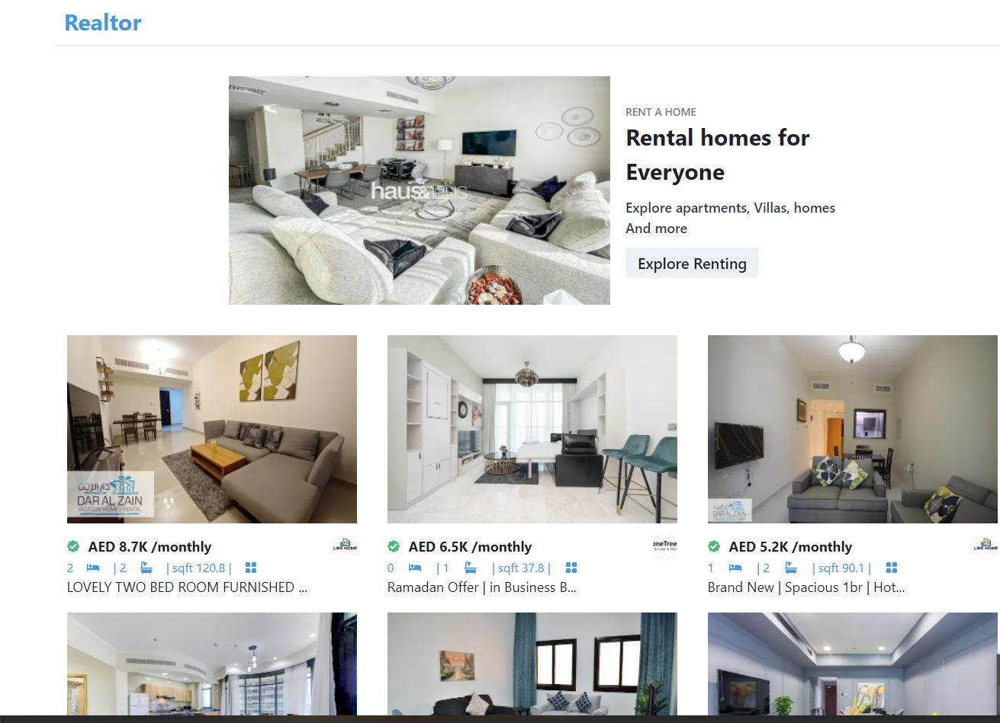

# Realtor

Find the best properties for rent or for sale. Use the filters to customize the search and discover the best oportunities for your budget.

## Getting Started

First, run the development server:

```bash
npm run dev
# or
yarn dev
```

Built on top of NextJS with Typescript. Using the RapidApi service to query the Bayut API to get the best properties listed in the United Emirates.


Open [http://localhost:3000](http://localhost:3000) with your browser to see the result.
## Home Page



## References

This project is based on a youtube tutorial [https://www.youtube.com/watch?v=y47gYvXchXM](https://www.youtube.com/watch?v=y47gYvXchXM) 
The original source code can be found here: [https://github.com/adrianhajdin/projects_realestate](https://github.com/adrianhajdin/projects_realestate)